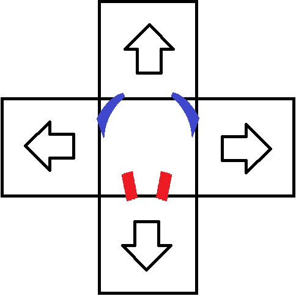

<!-- TOC start -->

- [Fierra's Guide to Four Panel Stamina](#fierras-guide-to-four-panel-stamina)
   * [Preamble](#preamble)
      + [Wait, but why?](#wait-but-why)
   * [Picking a dance pad](#picking-a-dance-pad)
      + [Panel Sensitivity](#panel-sensitivity)
      + [Panel Depth/Height](#panel-depthheight)
      + [Bar positioning](#bar-positioning)
      + [Center panel](#center-panel)
      + [The 'cabinet'](#the-cabinet)
      + [Closing thoughts](#closing-thoughts)
   * [Form](#form)
      + [The best form](#the-best-form)
      + [Why is based so good?](#why-is-based-so-good)
      + [The Slide and Pivot](#the-slide-and-pivot)
      + [Optimisation](#optimisation)
      + [Chunking](#chunking)
      + [Which muscles do I use?](#which-muscles-do-i-use)
      + [Posture](#posture)
      + [PUSH! GO! Chill.](#push-go-chill)
      + [Injury](#injury)
   * [Patterns](#patterns)
      + [Steppy and slidey](#steppy-and-slidey)
      + [Mono-directional](#mono-directional)
      + [Why don't patterns affect difficulty?](#why-dont-patterns-affect-difficulty)
   * [Chart Length](#chart-length)
      + [Marathons](#marathons)
      + [Midspeed](#midspeed)
      + [Footspeed](#footspeed)
   * [Structuring your set](#structuring-your-set)
      + [When to play](#when-to-play)
      + [What to play](#what-to-play)
      + [Yeah, but what content should I play?](#yeah-but-what-content-should-i-play)
      + [Failure](#failure)
   * [Clothing](#clothing)
      + [Headwear](#headwear)
      + [Bodywear](#bodywear)
      + [Footwear](#footwear)
   * [Gameplay](#gameplay)
   * [Environment](#environment)
   * [Nutrition](#nutrition)
   * [Stretching](#stretching)
   * [Data Tracking](#data-tracking)
      + [Tracking your song progression](#tracking-your-song-progression)
   * [Mindset](#mindset)
      + [Excuses](#excuses)
      + [Persistence and failure](#persistence-and-failure)
      + [Self-improvement](#self-improvement)
   * [Closing](#closing)
   * [Resources)](#resources)

<!-- TOC end -->

<!-- TOC -->
# Fierra's Guide to Four Panel Stamina

<!-- TOC -->
## Preamble

Hello, I'm Brittany (Fierra) and I'm a dance game player that's heavily invested in upper level 'stamina' gameplay. I wanted to put together a guide that would help compile my thoughts into one place. The guide I'm offering is without consultation of others, and entirely based on my own opinions, unfiltered.

Before that, I want to get introduction and naming out of e way. Four panel 'stamina' based gameplay is heavily based around Dance Dance Revolution, which spawned a competitor in In The Groove. In The Groove became a platform for custom content through arcade cabinets' USB stick support in the mid 2000s. This slowly lead to a scene of high level players pushing their physical boundaries. Dance Dance Revolution songs at the time would span in difficulty from level 1 to 10, and In The Groove, loosely similar, would scale from 1 to 13. Players began to wonder "what about a level 14? or 15?" and created content to fill that gap. Over time, this spawned two rules. If it's faster, it's harder. If it's longer, it's harder. Since that point, those original levels have been a loose basis for all further content, which now spans up to level 40 (sorry, 41, while I was writing the guide). The goal of this guide is to cover what it means to go so fast, and so long, and how to make it so that you, too, can hit the illustrious high level content.

Due to the historical usage of In The Groove for custom content, the games rules on timing and lifebar have remained at the core of the community well into the 2020s. Players generally prefer an emulator, now, but we don't have an official name. ITG, Post-ITG, Stepmania, Four Panel are all names I've heard used, but to make life easier, I'm going to refer to it as Four Panel or Stamina, to be specific about the content we're covering. The software typically used is [ITGMania](https://itgmania.com).

The guide is primarily for players who are moderately comfortable with the concepts of stamina, already, and are capable of reaching levels for entry into Stamina RPG, which starts at level 11. If you're not at that level, this guide won't be particularly relevant to you, and I'd advise the [Starter Pack of Stamina](https://docs.google.com/spreadsheets/d/1vnsJu85DxRA2Spq71g_MheY2B0_j99dPC1ap5RVQX-4) and [Starter Pack of Stamina 2](https://docs.google.com/spreadsheets/d/1Tp8zGud8nKV7yLzUlKP8sdyjRYIDKW3KTTC_xhLDi2Q) packs until you're feeling more comfortable with the game.

My strong recommendation for content is to participate in [Stamina RPG](https://srpg7.groovestats.com), which is an online tournament spanning June-March each year. I'll be using it as a basis to help guide the process of improvement. By following the instructions on the page, you'll be able to set up your accounts, software, and game content. Note that I've linked Stamina RPG 7, which is the event of 2023, and will be replaced year on year. You're also going to need a dance pad, but we'll need to deep dive into that.

When I was getting better at the game, I had to talk to higher level players constantly in order to absorb all of the knowledge that they've accumulated, and come up with my own understanding of how it all works. So this guide is just that. A compilation of thoughts of a high level player, opinionated, and long-winded, to act as a reference of potential useful thoughts to help you on your journey.

Finally, I'd advise joining [Stamina Nation](https://staminanation.com/) on Discord. It's a great community that are happy to help anyone whatever their level.

<!-- TOC -->
### Wait, but why?

To start out with, I want to give an example of what this actually _is_. Here's a video of my current maximum, [Footsteps of Doom](https://www.youtube.com/watch?v=_vy_w70kUa4). When people first watch content like this, there's a mixture of thoughts. 'That's not real dancing!', 'That's incredible, how is that possible?', 'You can't possibly be serious.'.. but mostly, the underlying question is **Wait, but why?**

The most interesting part about playing this kind of content is that movement optimisation, muscle conditioning and good technical practice results in a sort of exponential return on investment, in terms of the length you can do. When you begin doing 10 steps per second, it's one of the most powerful feelings in the world, and you'll manage maybe a few seconds before running out of gas. But with a little practice, you'll find that you can soon do a few more seconds. And then you can double that. And then you can double that, too. Before you know it, the amount of time you can play 10 steps per second will be limited only by your desire to stand up and do it for that long.

The progression of the number of steps you can perform in a given time frame is a lot more of a linear, or even logarithmic return process. But the faster you go, the less time you'll be able to sustain it. For example, at 10 steps per second, you may handle an entire minute. At 12 steps per second, you may lock up within a few seconds. As you become faster, you'll be able to handle slower content for longer. As you become able to play slower content for longer, you'll be able to go faster. The joy of performing 10 steps per second for the first time is unbelievable, for those few seconds. So when you begin doing it for minutes at a time, you begin to feel like a monster.

For some of us, this feeling moves into 20 steps per second and above. It's addictive, and it feels incredible, it feels like Dragonball Z, with absurd power levels that go beyond and beyond. And then, you keep pushing speed and stamina until you get to be at the point that I'm at in the video above. And then you keep going, still. I love this game, for its benefits to my physical health, mental wellbeing, the community I've been involved in, the skills I've picked up, and the feeling of pride I get from high level attainments. I've slowly blended my physical skill with my technical skill in improving at the game. It's an incredible synergy, letting both myself and my pad and environment improve. That's why I play, and that's why I want to share what I know.

<!-- TOC -->
## Picking a dance pad

Firstly, there's only one standardised rule at the moment, and that is the gap between panels. Your center panel should be a square of 11", or 280mm, separating the four cardinal panels you play on. How deep below, or raised above the center panel those cardinal arrows are is fair game. How wide your panels are is also fair game, where some choose a lower-profile 'Travel Pad' style design that's more portable. But whatever you choose, you should make sure your panels are spaced at least 11"/280mm apart, with at most, some small gap of around 1/8" between the cardinal and center panels.

Personally, I play on a [RE:Flex Dance Pad](https://reflex.dance), it's a DIY project I run, a little bit hard to obtain the parts for, and has some high technical knowledge requirements. That's just a shameless plug, though. There's a great guide in [ITG Resource](https://nvplus.github.io/itg-guide/pads.html). But in terms of quality, you don't really need an awful lot. Yuzu is a player who plays on [Force Sensitive Resistors, glued to the floor, with Yugioh cards on top of them](https://www.youtube.com/watch?v=EsLaV4BusjQ). And yet he's one of the top three stamina players in the world at time of writing. 

Many players prefer to focus on themselves, when thinking of improvement. The truth is, it's symbiotic. Your dance pad suits your form, your form suits your dance pad. Sometimes, pushing harder isn't better, and instead, modifying your dance pad will give incredible returns. Comparing a lot of the top players, and the variability in their dance pad, I can spot four identifying factors in terms of getting the perfect platform to improve your game upon.

<!-- TOC -->
### Panel Sensitivity

For sensors, old-school arcade dance pads, using thin sheets of copper with a little flexible material between. By pressing the panel with your foot, the copper sheets make contact, and this would count as a press of the panel. This is finicky, and non-ideal. The geometry of the sensors varied wildly depending on the dance pad build. The sensitivity was often far too low for most players' comfort, resulting in a lot of modifications to get everything 'just right', though still never quite met the mark for many.

Nowadays, Force Sensitive Resistors or FSRs are the choice for most players. The software for input made by [TeejUSB](https://github.com/teejusb/fsr) is excellent and has a great setup guide. Load cells are also an attractive option but require a lot more mechanical and electronic support. I hope one day we'll get to the point it's the community standard, but for now, FSRs are more DIY-friendly, much quicker to set up and easier to maintain. Whatever pad you pick, go into it expecting to upgrade to FSRs or load cells.

With the consistent response of FSRs and load cells, and the ability to modify their sensitivity quickly in software, this allows you to find the best sensitivities for your current needs. There's a lot more that can be done here, with some rather smart decisions in software processing to filter inputs from non-inputs. Personally, I use [software](https://github.com/brittanyb/playground) with thresholds to adjust for the panel turning on, and turning off (hysteresis), and allow any of the four sensors in the corner of each panel to turn the panel on.

Finally, make sure your panels don't have 'dead zones'. They should be sensitive all over, especially towards the inner edges and corners, towards the center panel. There are a number of fixes if your panel does have dead zones, and you may find more information asking around on Stamina Nation.

<!-- TOC -->
### Panel Depth/Height

Old-school arcade dance pads had panels several millimeters below the center panel. Over time, players didn't enjoy the feeling of dipping their feet so far in, and those players began to modify their dance pads to have panels more flush with the center panel. Even further, players began to raise their panels. Personally, my up and down panels are raised over 1/2" or 12mm each above the center panel as my playstyle has adapted. The most important factor here is that whatever surfaces you use for your cardinal panels, they should be easily raised and lowered, towards the inner edge of your center panel.

This is a big part of the feedback process in improvement, and I can't stress how iterative this. If this is difficult, and requires a lot of unscrewing and modification, you'll likely raise your panels too far, find it terribly uncomfortable, and drop them back where they were. Personally, my panels have velcro risers, allowing me to lift the panels with enough force from my hands, place further velcro risers in/remove them, and replace the panels quickly, allowing me to perform these adjustments whenever I like. This doesn't have to be particularly complicated. Again, Yuzu with his Yugioh cards being used to raise his panel surfaces is more than acceptable enough to have a high performance dance pad.

You'll want the panels to have edges that aren't particularly sharp, too. Otherwise you'll rip up your socks and toes. A slight bevel to the edges will do anything.

<!-- TOC -->
### Bar positioning

The bar position is important for allowing you to position and distribute your weight, along with balancing during play. Old-school arcade pads had fixed bars, typically built around whatever was believed to be an 'average-sized' player, spaced quite distant from the dance pad surface. Nowadays, players prefer to have a bar suited for around their height, personal preference, and it's often a lot closer to the dance pad surface itself. Personally, mine is relatively low, despite being 5'8", and is positioned quite far over the down arrow. 

As before, being able to modify the bars position easily is a very important facet. Mine's adjustable, and has moved in its depth, height, and where I hold it horizontally over time. DIY options include barres used for ballet, and even zimmer frames. I tend to move my bar based on how my back and arms feel, and try to keep it supporting as much of my weight as possible while staying comfortable during my gameplay. This is a personal process, but is worth experimenting with, as it'll teach you a lot about your form and how you should be using the bar to support your improvement.

<!-- TOC -->
### Center panel

Sliding across the center panel is a major factor in improvement. To do that, you should have a smooth surface. For the panel itself, I would suggest either a stainless steel panel, or one like mine, which uses just about any base material, and has layers of primer, paint, and lacquer with hardener on top of it. There's not too much to talk about here, but it should be hard, smooth, flat and stiff. There's a lot more in managing the slideyness of the center panel, but that's a later topic.

<!-- TOC -->
### The 'cabinet'

With every good dance pad, you need a good 'cabinet'. This was typically when an arcade cabinet was attached to the dance pads. Nowadays, you can just buy off the shelf stuff. I recommend a monitor with 120-144hz refresh rate and low input latency, and placed at eye level, comfortable for you to see and maintain a neutral posture. The speakers are less important, but if you want to treat yourself, grab a good pair and a subwoofer.

Having actual space for storage in your cabinet is useful, to fit all sorts of various bits you'll use during gameplay. A decent keyboard and mouse that're wireless will be useful, with a place to store those. And the computer you use should be good enough to run ITGMania. Luckily, a toaster is more than enough. I also recommend a webcam, as taking video of your sets will let you re-watch what you do, and find what is and isn't working for you.

<!-- TOC -->
### Closing thoughts

That's about it for the pad setup. The important part is that you're going to be working within a non-stop iterative process, with variability happening in your body as well as the pad over time. As you can see, there's no simple "get this, and it does everything" answer. Whatever you choose, there's DIY. Getting comfortable with creating the best setup and maintaining it will be a massive benefit to your ability to improve at the game, and with a skill as optimised as this, try to be very aware of the tiny, tiny changes to your pad that might help you.

<!-- TOC -->
## Form

<!-- TOC -->
### The best form

Form is how you choose to move when hitting the arrows in gameplay. Dom has an [excellent video](https://www.youtube.com/watch?v=gwWgmGjeyRs) showing the different form styles. He makes great cases in comparing the main forms and concludes with the belief that based may be the best of them, but suggests to play whichever you feel comfortable with. This is where I differ, and feel that if you want to be one of the best, regardless of how good you already are, you should learn the based, or toes-out form.

The first time I saw based form, it was Trevor, or trev0115, in early 2016. It was kind of terrifying, really. Up until that point, Mad Matt had been far and out the best player, ever. Then this kid showed up, and started playing with his toes outward to hit up, left and right, and heels only for down. It was very uncommon. At the time, many of us chalked it up to just being a bit of an irrelevant artefact. There was something else making him special. Maybe his size. Something. But he got _good_ in a scary way, and quickly. He quickly became the best player, and pushed into doing things that didn't make sense. At a time where < 5 players had passed Last Trip, Trevor could pass it at 110% music rate. Truth is, we'd all learned heels out back in the earlier days because it was the one way to get enough of our weight on any undersensitive panels to actually trigger them. But Trevor played on a home pad, and played upper level content on it, never moving away from toes out.

Since that point, levitass especially has pushed the boundary, going into levels I genuinely believed were physically impossible only a short number of years ago. The best players all appear to play based. I don't think it's a coincidence, but rather a very specific case that those who learn it benefit from it, and can become incredible.

<!-- TOC -->
### Why is based so good?

I'm a heels out player by nature, with my heels pivoting to hit down, left and right, my toes on up. I got [pretty good](https://www.youtube.com/watch?v=9pCpLWBZZN4), but never one of the best. I moved to based form in July 2022, having to completely start again. My logic was "If I'm never going to be the best, then what do I have to lose by trying to be as good as I can?". I had enough evidence that it was better, and I quickly learned that based is by far the best form for four panel stamina.

As Dom points out in his video, you're not moving your feet. Your toes have a pivot for left/right/up, and your heels hit the down arrow. So the only movements are pivoting, or a slight push back and forward on your heel, where your heels never leave the dance pad. I'd equate it to the [Fosbury Flop](https://en.wikipedia.org/wiki/Fosbury_flop), but far more powerful a paradigm shift.

At first, I had a hard time adjusting. I dropped from level 20 back to level 9. It wasn't nice. The panels never seemed to trigger, so I had to mess around a lot with my panel heights and my panel sensitivities. I couldn't keep my heels on the center panel. Then I started getting better. I noticed on marathons that my back simply didn't hurt anymore, like it used to as I wasn't regularly lifting my heels and causing stress on my back. I noticed that I wasn't becoming exhausted anymore, because my movement was so reduced. My sessions became longer, more frequent.

I think the power of based form is best shown through skill explosion. For CrackedCaptain, he jumped from 20->24 over about a month. For me, that same jump happened in about two weeks. Once you develop those small efficiencies, and you suddenly 'get' how to move more efficiently, you get to have this absolutely monsterous push into higher levels. With heels out form, every new bit of speed was a struggle. 240bpm felt like a monster to get ahold of. And 245bpm just felt.. out of my reach. It was like being on a skill curve and watching my output reduce. In based form, that just doesn't seem to happen. I'm sure it happens somewhere, since there's got to be some point that humans reach a limit. But with based form, 500bpm is quickly approaching at time of writing. For me, the 240bpm monster with heels out took me a few weeks to get a handle on with based. And once I was there, 250 was barely harder, and 260, and 270. That's what based does with an efficient, sliding style. It turns the logarithmic nature of speed output into a linear one.

<!-- TOC -->
### The Slide and Pivot

I've emphasised sliding and pivoting in a few places in this guide, but I wanted a more dedicated section on it, as it's the base of based form. All of your weight is based upon your heels (okay, and the bar). Behold the only diagram in this guide.

 

The heel motion is marked in red, showing the entirety of their work. They simply slide, back and forth, engaging the down arrow, or moving into the position to pivot the toes for left/up/right. To hit the down arrow more than once in a row when your heel is already there, it can be a bit tricky, and takes some experimentation. With a raised panel, a small bump/rocking motion can hit multiple hits in a row. For me, this is still something I'm not perfect with. Sometimes, I will have more of my weight on one heel, rather than evenly distributed, allowing the other heel to do just a little bit of lifting to hit the down arrow multiple times. The point isn't to get this perfect first time, or you'll be miserable. The point is to understand that the aim is even distribution of weight on your heels. Awareness will help you to figure out what you're doing wrong.

For the toe motion marked in blue, the goal is the pivot. Ultimately, you're using a combination of hip and ankle movement to pivot. When your heel has moved to the correct location, which takes a bit of practice to get down (and is also why raising your panels to give good tactile feedback is so useful in learning the motion), your toe will be able to just about touch the up and left/right arrow. A mixture of a little bit of ankle lift, and toe lift will allow you to engage multiple hits on a single panel.

Finally, there's the angling I've used in the diagram, which has a specific reason. If the heels move straight up and down, and your toes are already on the left arrow, as your heel moves between the positions, your toes will remain on the arrow. This makes it a lot harder to disengage the panel, and means holding on to the panel longer. By naturally moving inwards towards the down arrow, and outwards towards your pivot position, you're able to naturally engage and disengage the left and right arrows on the way to and from the up and down arrow. This is the most powerful optimisation in based form, because it effectively allows you to hit the up and left/right near simultaneously. Additionally, having a slight outward motion, you're using your hamstrings/quadriceps and hip adductors/abductors to accomplish the push/pull motion to slide on your heels, giving you extra control.

As I'm not sure where else to put this - I strongly recommend wiping furniture polish onto your center panel with a microfiber cloth, also. Anything with some kind of dry lubricant is useful, and it'll greatly improve your sliding ability. Players often find slideyness to be a 'problem' rather than a help. I think this partly comes from a lack of understanding about how important the correct form is. Slideyness is a skill, and is built on over time. The first time I used baby powder, it was a nightmare, furniture polish was even worse. Now, everything I do is based around ease of motion. When your form starts to become less about 'pushing' and more about 'control', you'll find that slideyness helps you to move more freely, and put less effort in, allowing you to keep better control of your motion. If you struggle with slide, try to slowly increase it, rather than going from a rubber center panel to an ice rink instantly.

<!-- TOC -->
### Optimisation

I learned how to slide with this form the most, as the movement became easier to master. This is because in based, all my heels are doing is moving up and down, in a push and pull motion, while my toes handle the pivoting motion. Having your feet always firmly putting your bodyweight on the center panel let's you move at unbelievable speed.

You will find that with raised panels, it becomes a lot easier for your form to be controlled. A higher down arrow will prevent your heel from sliding over the edge, and helps you to remain with your heels firmly on the center panel, relying mostly on the bumping motion to hit the down. For left and right, a slight raise allows the the toes to more easily apply pressure without extending too far. For the up arrow, a large raise prevents the foot from pushing over it, only allowing the toes the movement necessary to engage it. Again, this is iterative and requires regular change and experimentation. But over time, if you're doing it right, your panels should be raising and improving your form.

There's no consensus yet on how far the pivot should be. Logically, we should expect that the less rotation of your feet for left, up and right, and the less movement of the heels, the better you will be. Logically also, having some grip on the panels, by having more pivot, and more foot in contact with the panel, allows you to push off of it onto your next panel. It seems that control is a lot more than precise movement efficiency, so whatever you feel comfortable with in terms of the range of motion will likely help you the most. For that reason, try not to focus too hard on the pivot range.

None of this is absolute. I have a slight lean onto my right foot, and my left foot moves more as a result. My left foot also likes to overshoot the down arrow at times, and the heel leaves the center if I'm not careful. The important thing is to be aware of these factors, and work on them.

<!-- TOC -->
### Chunking

This section is hard to make fit anywhere, as it's a combination of gameplay factors, as well as form. It's the answer for "how do you read and move so fast?". Chunking in psychology occurs when the brain groups together larger groups of information into smaller units of information. In touch typing, this is often described as 'writing the word, not the letter'. The word "sometimes", for example, splits into two sections, "Some" and "times". The brain quickly recalls both of those two motions from procedural memory, rather than the individual letters, and muscle memory is then used to execute the ordering of the fingers tapping each latter.

The same thing will occur in four panel stamina. To me, the sequence L -> D -> U -> R, doesn't get read as singular arrows. It's a singular, swiping motion. If you take a video of mine and speed it down to 0.25x, you can see that I'll hit the arrows with these swiping motions, causing the larger timing distribution. In fact, sometimes I'll even hit the arrows, particularly the up and down, out of order in a pattern. This is because my feet handle motions independently to one another.

This is a process related to memory, so it's often not a particularly conscious decision. By watching lots of high speed charts, performing the motions in your mind, and being able to match them with your feet, they will eventually become more natural, and you will start seeing patterns, not individual arrows, without thinking much. As it's also a process that relates to both memory _and_ recall, you'll likely be surprised at your increase in speed. I was able to read 240-260bpm streams at a maximum for about 12 years. This is because it was my maximum output. When I would watch faster streams, it would appear impossible. When I switched to based form, and 280bpm became possible for my feet, at first, it was almost impossible to keep up with, mentally. My brain eventually performed the chunking naturally. I think this was playing it regularly, but also watching other players was helpful for this. Now, I can read 400bpm streams, and when I see faster streams, I trust the process that I will be able to read even faster.

<!-- TOC -->
### Which muscles do I use?

Over time, your muscles will adapt to these motions in terms of their growth. You'll get more efficient in the motion, gain better muscle memory, and learn the tiny optimisations. But one surprising part is the sheer level of co-ordination between your muscles to get good at this game.

With based form, I've found the answer is you use.. basically everything. Your core, lower back, and deltoid muscles tend to be a big deal in terms of keeping you upright and stable. But the legs are powerhouses here, and just about everything is important.

Although your ankle is appearing to pivot, it tends to be more of a whole leg motion. So your hip rotator tends to be a very strong way to build a good pivot. Hip adductors/abductors and hamstrings/quadriceps are also busy producing the outward push motion towards the up/left/right position for the toes, and pulling them back inwards to hit the down arrow. The ankle itself does have some small part in this, too, with just about everything in there being engaged in a lot of the micro-efficient motions, the tibialis anterior doing a lot of the lifting work for pulling your feet upward and downward for hitting multiple of the same panel in a row. The extensor digitorum/hallucis longus are also useful for this, allowing the toes themselves to generate a bit of extra lift for your left/right and up arrows respectively.

You don't need to remember all that, but the important thing is to remember that your whole body is involved in this. Your muscles should be loose, and all looking to do part of the job in getting the push/pull, lift, and rotary motions comfortable.

<!-- TOC -->
### Posture

'Your best posture is your next posture' is a pretty strong quote used to describe how people should sit/stand, and it equally applies to dance game posture. Posture is dynamic, and the more you modulate it, the more options you'll have when you play. This is especially true in marathons, where I'll constantly be shifting my weight in order to find my comfort in different places.

Typically, top players seem to have either a forward or backward lean, that shifts throughout gameplay. By leaning backwards, players are putting more of their weight onto the bar, and less on their heels. This makes movement easier, so is especially useful at lower speeds.

With more difficult patterning, or faster speeds, players often start to lean forwards. This helps give you control, pushing your toes further down and being able to shift your weight more easily.

I would describe the difference between the two as 'backward' lean being more deliberate to find comfort, and 'forward' lean being more automatic. I've often tried to lean forward to improve my control, but as I do it deliberately, it doesn't help me. When I lean forward and I'm performing well, my body shifts its position a lot. This is what I mean by exerting control with the position of my body. It's more of an automatic response. My body leans forward and shifts around to stay in control of complexity it can't easily handle.

Try to experiment with your posture a little. You'll find it's very important during longer charts, and much easier to find optimisations for. But when it comes to mid and high speeds, your posture's going to likely shift naturally throughout the song, becoming gradually more and more forward as you lose control.

<!-- TOC -->
### PUSH! GO! Chill.

Players often used to scream at each other when playing. This game was very, very high energy. You would overcome your boundaries by putting more and more of your power into it, gasping for air and trying not to cry.

Based form doesn't allow this. With based form, the harder you push the more likely you are to experience 'form explosion', where your feet move too far, and you're unable to drag them back to the next panel in a controlled manner, resulting in a rapid loss of life.

In based form, you should be trying to stay in control. It's a calm motion. Of course, there's always going to be a bit of push as you tighten up, but the goal is to keep your muscles loose, and your form under control. It can be frustrating to lose control. For me, the anticipation of passing something hard is enough to spike my adrenaline and cause me to lose control. But that's the new challenge. Not raw power, but determined, controlled power.

<!-- TOC -->
### Injury

Based form also introduced me to my first non-trivial dance game injury, as it has with several people. Going so fast, getting that good, that quickly, being able to go so hard for so long, it's very tempting to push yourself too far, or to ignore the advice to settle down, because you feel fine. I know, because I ran tendons first into that issue.

I got digitorum longus extensor tendonitis in my right foot. The quick gains I made by going too hard were very much offset by my nine month recovery. Ultimately, you can't _just_ slide. Depending on the patterns, your feet may already be on the panel they're meant to hit next, in which case, you will need to lift a little, or rock/micro-pivot in some way. This isn't as much about logic as it is about practice. You eventually get comfortable with the movements. But my major suggestion here is don't play in pain. And for at least the first six months, please avoid any longer marathons. 

Marathons will cause the most repetitive strain, and aren't worth it at this stage. They're not the best way to improve. The unoptimised, new movement that's honestly quite unnatural to your body carries the tendonitis risk. Don't play in pain, it's not worth the risk. If you're feeling the strain, take a break from the game. Start again when you're no longer feeling it. Trust me that any of the amazing, explosive gain I made in those few first months of based were quickly offset by the nine month recovery. If I'd have gone at half the speed, I'd have done far better, far quicker, with just a bit of patience.

After my second season with based form, I can say now that I just don't face tendonitis anymore. The movement is natural enough to me, now, and injury appears to be at bay, for now, and I'm good to do lots of marathons and just about any content I like.

<!-- TOC -->
## Patterns

<!-- TOC -->
### Steppy and slidey

Checking out the [Stamina Pattern Reference Guide](https://nvplus.github.io/itg-guide/patterns.html), I'll use this as reference when talking about patterning for this section. There's a few terms that will help understanding of how this all works and applies to based. Players often refer to patterns as either 'slidey' or 'steppy'. 'Slidey' patterns on this page are exampled by the different staircases, helicopters and zeta slides, and 'steppy' by hipbreakers, luchis,towers, etc. Something is steppy if you are lifting your feet to hit panels multiple times in a row, and slidey if you are always moving your feet from panel to panel instead. For based form, it appears that sliding is the king, allowing you to rapidly trigger a lot of panels through quick pivots and panel-bumping with minimal foot raising. Does that mean it's the only thing that you can do with based? No.

My experience of based is that although it tends to work best with slidey patterns, based is still best when it comes to most patterns. I may've improved massively with sliding patterns in based form, but I've also improved at steppy patterns, just not as much. Nonetheless, depending on the proportion of slidey to steppy patterns, my experience of a stepchart can greatly change. This has always been the case with any form I've had, with deficiencies and optimisations being applicable to all. But based has allowed me to conquer a hell of a lot more than I've done with any other form.

<!-- TOC -->
### Mono-directional

Mono-directional or 'mono' patterns are those in which the foot hitting the up and down arrow does not alternate. This naming comes from the oldest form of high-level stamina play, where players would be positioned mostly over the brackets of the panels, with 'facing right' indicating a player with their right foot on the down and right panels, and left foot on up and left, and 'facing left' with their right foot on up and right, and left foot on down and left. For a good example of mono patterns, a double staircase is a mono-directional pattern, an alternating staircase is not.

Back in those dark ages, 'mono' was considered to be lazy, easy patterning, due to the fact that you 'didn't have to move'. Nowadays, it throws off most optimised forms and is considered much harder to execute. At high speeds, mono patterning keeps your form unbalanced.

<!-- TOC -->
### Why don't patterns affect difficulty?

The truth is, they do, very much. If you made a chart of only tower patterns, I probably would be reduced to around half of my maximum speed and longevity.

The problem is, patterning is subjective. As I mentioned with mono patterns being considered easy in the past (often associated with some pretty crude 2000s name-calling that doesn't fit well into the 2020s), we now consider it far harder. Though it may've been nearly cheating back then, now it's an example used to discredit higher-level form.

Based might be the best we have right now, but I'm not convinced that it's the 'final' form. As we improve, we want to continue to improve, and we change ourselves, and the game to facilitate it. By mostly disregarding patterns in difficulty, it lets us stick to the objective fact that speed and length defines difficulty.

For the subjectivity of pattern difficulty, we may one day hope to quantify patterns more. Until that point, top level players will simply say "that chart had insane patterns!" even if it's not at the maximum 'difficulty level' that player can handle. And at this point in time, based players typically prefer bi-directional patterns with lots of sliding, and varying levels of steppiness to keep things interesting.

For a visual example, [Mission Complete](https://www.youtube.com/watch?v=nPM3f4w8MFM) was a very hard 'patterny' chart at level 28 for me. [Departure 6 FB](https://www.youtube.com/watch?v=iB9FIKxP6mY), is faster, but considered to have very easy patterns, with lots of sliding.

<!-- TOC -->
## Chart Length

<!-- TOC -->
### Marathons

Marathons are 16+ minute stepcharts, consisting mostly of pushes in endurance. They're brilliant for building grit, and muscle strength. However, they have the least yield in terms of raw gain in capability in the game. I would recommend playing a short marathon during your warm up, or warm down. If you're finding faster content difficult, it's also worth playing marathons during your main set, as a fallback. They're a useful skill, and you should be doing them occasionally. I've found though that players who 'main' marathons are more likely to have a hard time relaxing their form, and maintaining consistency at higher speeds. Typically, the ranges are defined by the BPM you can handle. My marathon range tends to be 250-300 at time of writing.

<!-- TOC -->
### Midspeed

Midspeed tends to cover songs with a great deal of stream, but not really enough to be a marathon. I find that anything I can sustain 2 minutes of, or more, but less than marathon, I consider to be midspeed. I believe this is the most powerful range of improvement. Midspeed builds incredible consistency. It tends to 'feel' like you can't quite get comfortable, but that you can manage this speed on nearly every set. By playing midspeed, you will become a lot more comfortable with marathons, and you will equally be able to improve how you feel at even higher speeds. I believe this is the best range you can focus on for the most part. For me, midspeed is currently in the range of 300-340.

<!-- TOC -->
### Footspeed

Footspeed has typically been bursts of speed. 20 second to 2 minute bursts of speed at your maximum speed tends to define this range. Many players find explosive performance gains at their highest speeds, allowing them to very quickly ascend the ranks in the game. That being said, footspeed is inconsistent, and often referred to as 'dicerolling' due to the lack of predictability. Players who 'main' footspeed often seem to struggle with immunity to many types of patterning, and often struggle with maintaining longer stretches of gameplay. It's a good way to get good, quick, but carries a cost. That being said, footspeed teaches you how to optimise your form in the best way. By going faster, you gain a lot of insight into how to optimise yourself. For me, the range of 340-375 is currently where footspeed is.

<!-- TOC -->
## Structuring your set

<!-- TOC -->
### When to play

For set structure, there's two main questions players often ask. 'How often should I play?' and 'how long should I play?'.

This is subjective. If you're newer, then the answer will be less, and gradually ramp up. But consistency appears to be key. My opinionated answer is that I prefer two days on, one day off, and for my two days to be sessions of 1hr30min on average. If I'm in any amount of pain, I will take more time off, and every couple of months, take an active recovery break.

I think the more that you're able to play, the more quickly you will improve, as this is a structured focus. But the quantity of your sessions will greatly influence your experience.

<!-- TOC -->
### What to play

The session consists of three main parts. There's your warm up, where I would recommend starting at a comfortable level. Each stepchart you play should ramp up in length and/or speed. Your goal is to warm up in a way that keeps you relaxed, and keeping your form controlled for as long as possible in your 'marathon' BPM region, until you enter the region you feel uncomfortable in, the 'midspeed' region. Warming up too fast will often lead you to feeling like you're less in control of your form, and 'explode' more quickly. Over time, you'll figure out what 'too fast' means for you, and how long a warm up should last. I find it's around 30 minutes or so.

When the warmup is over, you're in the main region of your set. I find this lasts around 45 minutes. I try to get as much midspeed into this range as possible. On days where I feel physically strong, my midspeed tends towards the higher part of my region. This is when I might take my chance at some footspeed to get my absolute maximum up. On days where I feel weaker, I struggle to even stay in midspeed. This is when I will consider a marathon instead, or alternatively, something slower with more heavy patterns that I'm not used to. With this in mind, I'm always finding something I can improve upon. A lot of the skill here is in determining when your efforts aren't going to produce good feedback. Grinding against a wall isn't going to move it. But sometimes, you may find a second wind. Therefore, if you think you're hitting a wall, back away from it for a while, try some other stuff, and then have another attempt. You will feel less like you're losing your mind.

Although I've stressed midspeed as the best zone of gameplay, don't forget _why_. I consider it the best way to comfortably, consistently improve your general speed. Improving your speed will yield better returns in skill than pure stamina. Always dip into different forms of content to figure out how it works for you, and where these best ranges sit. I find my speed gains suddenly.. happen. Some days I just go really, really fast, and stay really, really fast.

Finally, in the warm down region, you tend to be a little bit out of sorts. You're tired, flustered, and it's time to bring the speed down. For me this is about 15-30 minutes. Again, I go with slower, longer stuff in this time, with more pattern heavy charting.

<!-- TOC -->
### Yeah, but what content should I play?

The [ITG Packs Release Spreadsheet](https://docs.google.com/spreadsheets/d/1F1IURV1UAYiICTLhAOKIJfwUN1iG12ZOufHZuDKiP48) is a great list of packs. I'd recommend under 'Tournament Packs' getting all of the ECS and Stamina RPG packs. They're awesome and cover just about everything you'll ever need. The charts cover a range of patterning, speeds and lengths.

<!-- TOC -->
### Failure

When you're in the main region of your set, many players have the temptation to 'only play what they can pass'. This tends to be a good way to build a wall that you can't surmount. Although pushing for passes is always the gold standard, the truth is that failure is a natural part of the speedy improvement process, as it indicates that you're regularly challenging yourself with things that you're not comfortable yet doing, learning the new things that you need to. I fail a great deal of content that I play. Probably well over 50%. The more willing you are to attempt content that you know you may fail on, the less likely you are to develop a form based around assuredness, and more around the peak optimisation strategy to always push yourself beyond your limits.

<!-- TOC -->
## Clothing

<!-- TOC -->
### Headwear

I would recommend pushing all of your hair backwards, with no flicks sticking out. Use headbands, sweatbands, hairbands, anything you can. This is to prevent your hair from accumulating sweat, and dripping on the dance pad. Hanging a towel around your shoulders is the next step, keeping just about all of your head and neck sweat behind you, off the pad, and provides a quick way to wipe off during a set.

<!-- TOC -->
### Bodywear

This is less important, and just based on comfort. I tend to go with a tank top and loose shorts. Just wear whatever allows you to have good freedom of movement, and keeps you cool. A good pair of padded, fingerless (cycling) gloves will help you have a bit more comfort when holding onto the bar.

<!-- TOC -->
### Footwear

This is a game where you use your feet, so footwear is the most important thing about clothing to consider.

There are lots of different types of socks to try out. Typically, you'll be wanting multiple layers. This is a pretty good [Medium article](https://nguvinc.medium.com/itg-stamina-socks-3be04b0c57d8) on the subject. I've found the most luck with two outer layers, the first being a soft bamboo fiber, and the outermost being a thicker, partly PTFE fiber based sock.

Moisture control is important to maintain a slidey surface beneath your feet. For that reason, it's often recommended to wear some plastic layer underneath your outer layers of socks to prevent sweat accumulation. Bags specifically for feet are made for salon/spa treatments and are easy to come by. It's a big difference maker, so try it out, even if it sounds stupid.

Underneath bags, it's common to wear some kinds of protection for either your heels, toes, or both. Smashing your heels against the edge of a panel or poking your toes just a little bit over another is going to build up some nasty blisters and hurt. The longer your sessions, also, the longer the contact of your heels with the center panel will begin to hurt. Typically, some mixture of fabric/silicone heel cup, or toe cup will help to provide this protection.

Finally, my inner most layer of socks is just for comfort, and I'll wear anything in there, just so I'm not in direct contact with pieces of plastic and silicone. So this completes the absurd stackup of socks, from inner to outer, with any sock > heel/toe cups > plastic foot bag > bamboo sock > PTFE sock.

This does often yield the question 'why not shoes?' and the answer is simply 'tactile feedback'. Feeling the panels is a big difference maker, as it helps you to learn the control necessary. This is also why I prefer to put more stuff on my heels than on my toes, as it's not anywhere near as important to have strong tactile feedback on my heels, whereas the pivot of my toes requires much better control.

Hopefully one day we will have a big enough sport that we'll have some footwear that you can simply buy, and isn't a nightmare of sweat and anguish, who knows.

<!-- TOC -->
## Gameplay

This is a bit of a shorter section, as I'd hope you understand the basics of hitting the arrows. That being said, there's a few features of ITGMania and the game in general that are good to discuss in order to show how they can improve your gameplay.

To start with, the scroll modifier is how fast the arrows move towards the receptors. I find that the longer a chart tends to be, the slower I want the arrows to scroll. I play marathons around C820, and footspeed around C870. If you find that you are playing significantly early (check out the timing distribution graph on the results screen after you play a song), then you can experiment with speeding up the scroll modifier, which you may find makes your timing less early. The reason this is useful is that this game awards more lifebar recovery for better timing. If your timing is better, then you naturally have a harder time failing a stepchart. So changing around your scroll modifier will is a great way to get some free failure immunity.

You should turn on the features for a 'measure counter' based on 16ths, having the 'density graph' above your gameplay field, displaying 'step statistics', tracking 'held misses', and having a profile that remembers these parameters. These are all useful features to help you keep track of what's going on in the game, anticipate upcoming difficult sections, and get good data feedback.

In based form, the slideyness often results in a poorer timing distribution than other forms. This is okay, and not something worth tightening up an awful lot, as the looser your timing is, the more loose you can be in how you process, chunk together, and execute the motions. Checking the timing distribution graph after your song, if it becomes quite late, then it means you're running out of time to hit the arrows quite quickly. If you have to choose, it's always better, therefore, to be earlier than later, as you then grant yourself further time to react to more difficult to execute patterns.

After your song is played, check out the breakdown of timing judgments by panel in the score screen. This is the key insights into the synergy between your form and the pad. Lots of decents/way offs may be indicative of issues with either your panel being too sensitive, or a form error (often, hitting the panels when you shouldn't). Lots of held misses on a panel will also indicate that the panel is too sensitive, whereas lots of .. missed.. misses, means that you've likely not got your panel sensitive enough. Finally, an annoying split can occur where you get lots of decents/way offs, and lots of missed misses. In this case, the only options are to either do a deep dive into what's happening with your form/pad, or if you're lucky and have this feature, adjust the 'off' threshold of your panel sensors. This allows you to trigger it with low pressure, but not let it untrigger/retrigger with minor vibrations or changes in movement.

<!-- TOC -->
## Environment

Sliding around heavily on the center panel means you're going to be generating a lot of friction. Heat will just make you feel awful, and burn you out quicker. Having a fan aimed at your body is helpful, and so is having a blower fan specifically aimed at your center panel to reduce the intense heat buildup. If you're lucky enough to have air conditioning/heating, go for somewhere in 16-20c region to keep yourself comfortable. Keeping air circulating is also useful, as if you're playing in a closed off room, you're going to build up carbon dioxide rather quickly, and decrease the performance of your set.

Exercising also generates a lot of moisture. A lot of the skill in sliding effectively is based in repeatability of your environment. If humidity varies wildly, then you'll be playing under different conditions every time. That's not an ideal way to build consistency. For that reason, I recommend controlling your air humidity by using a dehumidifier. I play around 45-50% humidity, and found this to be one of the best investments into my gameplay, giving me the same experience every time I play. It also has a hidden benefit of pulling more moisture off of your body, which makes sweat management much easier, and less stressful.

<!-- TOC -->
## Nutrition

I'm not going to lie, this is not something I'm good at. I like pizza and burgers way too much. Nutrition isn't going to change your game, much. But it's worth mentioning nonetheless. As with all sports, quick carbohydrates like fruits will help with an energy boost during your set, and protein will help with your muscle build and repair process. I would recommend looking into electrolyte supplementation as this game gets you sweating a lot. I tend to use some of those in my drinks while I'm playing. I would also recommend considering creatine supplementation. It helps with bursts of strength and speed, potentially offering a benefit to footspeed. I've found it to be effective. In the future, I'll probably work on my nutrition to get that last squeeze of performance out of my sets, but the burgers, man. Focus on your macros, and if you're experiencing any dips in your energy, supplements are a great way to make up the rest.

<!-- TOC -->
## Stretching

The reason that I haven't given an extensive warmup/warmdown schedule detail is because I wanted to cover it a bit more here as a supporting subject. I found that by playing this game, I built up imbalances in my muscles. For a while, I had a deficiency in the pivot of my right foot, which has been improving a lot lately. This is because I have begun to pay attention to the flexibility of my muscles.

I don't do an awful lot, but I like to draw the alphabet with both of my feet, in order to help provide some ankle mobility, with lots of lifts and drops of my feet. Other than that, I have a group of yoga poses that've been particularly useful for me. I tend to do the pigeon pose, downward dog pose, butterfly pose, thread the needle. These have been my main useful ones, helping me a lot with flexibility in my hips, upper legs, lower back, and upper back. In addition, I've also noticed that my desk job keeps me sat down too often, which tends to raise my resting heart rate a great deal, and make exercise affect it a great deal more. 

It's hard for me to speak with much authority here, as it's all quite new to me, but I've focused on finding exercises that provide support in the key places I feel muscle pain, and I will do these stretches both before and after my sets. I've found a great benefit in my ability to move during gameplay, and my general comfort outside of gameplay. Despite my inability to explain this very well, I'm very, very glad I've been doing it.

<!-- TOC -->
## Data Tracking

Data tracking is the big secret for getting good at four panel stamina. What you can track, you can improve. And when you see improvement, you will want more.

This is the main reason that I do video streams on twitch.tv. It gives me the video data that I can easily skip through, cut segments out of, and re-watch as many times as I need. I find this is invaluable, as it lets me identify things that I otherwise would never see. It's helped me understand my leaning stance, my foot pivot motion, the balance issue between left/right. On top of that, high level players sometimes come and join me, and make suggestions. This is a game where community collaboration can make every bit of difference, and getting the extra feedback from them provides invaluable data towards improvement.

A heart rate monitor is an excellent investment, especially a chest strap. I use an H808S, along with the Pulsoid app, which lets me track my heart rate, and cross-reference it in reports (for free) to my video streams. I'm not going to advise you on your heart rate, because everyone's heart rate is different, and advising that would stem further into being medical advice, but having that data for yourself will help you to learn over time what does, and does not work for your improvement. I notice that my heart rate being around 180 tends to be my maximum 'okay for like 20 minutes' zone during marathons. I also know that if I go above 200, it means my body's about to give out. Knowing this information, it lets me quantify my bodies reaction to different stream speeds. My absolute maximum is 200-205, and happens only when I'm about to do something I've never done before, so I tend to try to push myself in HIIT sessions, peaking between 180-190 for most charts that I play.

Some data is a bit less linear, and harder to work out. By playing often in attempt at reaching your goals, all the frustrating moments you experience in plateaus and failure will teach you things about your play sessions. You can keep a play diary, if you like. Personally, I don't, and prefer to talk myself through what's happening as I experience it. Eventually, something clicks. "I need to work on my posture, my hips are out of alignment.", "If I push my butt up against the bar, it brings my hip in alignment", "If I push my shoulders forward during this difficult section of the marathon, I'll retain control, and then I can push backwards for the easier section to rest.". You'll be wrong, sometimes, too. A lot of the time, small changes I make appear to originally have some useful output, eventually turns out to be a dud. Sometimes, I will change my panels or my bar position in some way, only to find that I'm just weaker in that session than I usually am, and the dance pad was fine. Sometimes I'll improve for no discernible reason and attribute it to something unimportant. It's okay to be wrong, and it's an important part of the iterative process of improvement. These are the data points that take time to work out for yourself.

<!-- TOC -->
### Tracking your song progression

The main form of tracking you should do isn't block level. This is why people often say "ratings don't matter". They matter to me, because I like the feeling of being able to quantify my achievement. But the truth is, the real metric is "I can do x amount of y speed at z density". I therefore believe the best method of tracking would be taking each 10bpm tier, and being able to quantify these amounts, in order to aim to improve the numbers. Unfortunately, this is hard to quantify data, because stepcharts go to music, and music doesn't respect your precise needs for data tracking amounts of 16ths at given densities. This is why I still use block rating as a subjective measure, tracking the 'maximum block level passed at a given BPM tier'.

I like to track data from each song pack. I keep a spreadsheet of song packs that I own, and note each stepcharts BPM, length, and block level difficulty, as well as giving them a marker to denote pattern difficulty in terms of 'easy', 'medium', 'hard', and 'very hard'. I then have data tracking the number of songs left in each BPM tier, the total time remaining of the pack and the number of songs left in each block level difficulty tier. By doing this, it creates an incentive to play well rounded content, and to provide meaning in all stages of my session. Warmups become about passing new things that I've not encountered before. Warmdowns become much of the same. This is also why Stamina RPG has emerged as the king of progression in high level dance games. The tournament tracks your passes, and provides unlock and quest incentives. I would recommend strongly to start up an account, and begin setting lots, and lots of mini goals while participating in Stamina RPG. "I want to finish off the 150bpm charts" is a powerful motivator, and having as many motivators as possible gives you lots of focus opportunities in your set, even if things aren't quite going your way.

<!-- TOC -->
## Mindset

<!-- TOC -->
### Excuses

This is an important section, and one that I've been afraid to write about. I've ran into a lot of excuses when trying to help other players to improve at the game, and reach their goals. "My feet are too small", "I'm too old", "I don't think you need to do x to become good, because what about y person?", "Most of getting good is about x, so y isn't as important", "Some of us are just better than others because of genetics".

The truth is, when I read this, I see something else. "I'm uncomfortable with change". It's scary to talk about this, because it's a delicate subject. My goal is to help others experience how amazing this game feels when you reach the high levels, so I don't see excuses as something to judge people for. I see them as barriers that stand in the way of people's goals. If, deep down, the reasoning is "I simply don't want to play this style, or content", then that's not an excuse. It's just a fair, acceptable choice. An excuse is the putting off of your own goals, and finding an external reason that doesn't map.

Excuses aren't sensible. Players of wildly different body types are at the top level, and have no common factors, apart from those of form and session choices, most of which I've tried very much to lay out above in this guide. I believe strongly that since none of us are at the physical limit, and no single body type has emerged as the apparent best one, that we're all in uncharted territory, and that just about anyone of reasonable health and non-geriatric age can make it right to the top of the game, should they wish to.

<!-- TOC -->
### Persistence and failure

Many of the best players I've met have circumstances that make their improvement process difficult for them, or coinciding health problems. Those issues frustrate them, but they don't allow it to stop them from doing the right things to improve at the game. Their first instinct isn't "I can't do it", it's "How can I do it?". If there is something you identify in the top level players, you shouldn't think "I can't do it that way", if you want to be at that level, you should be looking for any way to change to be part of that.

I think deep down, a lot of the discomfort with change comes from a fear of failure. I understand that, and I have it in other parts of my life. This game has been a safe space for me since I was a child, helping me get away from the parts of my life I didn't feel like I could safely and comfortably fail and improve in. I believe this game is the most beautiful expression of self-improvement and overcoming your own limits. Not everyone in the community will be kind about your experience, and may choose to talk down to you. Some at higher levels, some at lower levels. And I can say simply, they can go fuck themselves, and then come back with a raw ass, and a more humble attitude, and learn to be helpful instead. This opportunity isn't one we should rip away from each other, and we shouldn't tear each other down. I can only hope that as a community, we can be the kind of people who will help people become comfortable, confident, and experience joy with self-improvement. Failure, change and persistence are all part of this journey, and there _are_ correct ways to improve, not all ways are equal, but the way in which we reach those paths needs to be encouraged, not discouraged or mischaracterised.

Surround yourself with people who cheer you on as you go for your goals. Surround yourself with the type of people who, when you fail to meet your goal, won't tell you that you can't, but will try to encourage you and help you to find solutions, and opportunities. And most importantly, be that change. Positively engage with people who are on their improvement journey. Be honest with yourself about what it means to improve, and honest with others, also.

<!-- TOC -->
### Self-improvement

Finally, self-improvement is the best thing you can get out of this game. My sets often resulted in a lot of anger as I didn't reach my goals. I still have bad days, but they've drastically reduced. I had realised that by becoming angry and sad, I was actually performing _worse_ at the game. It only made sense to then try to control my emotions, and to find ways to focus on things that brought me happier feelings. Now, instead of a miserable, angry breakdown every other set, I'm probably experiencing that once every 20 sets or so. Everything I've written in this guide isn't just 'stuff I do', it's stuff I've decided to do in pursuit of improvement at the game. Using progression in the game as a vehicle for being healthier, fitter, having higher confidence and emotional wellbeing, is amazing. A natural desire to go further in this game can be turned into the best way to become more than you were the day before.

<!-- TOC -->
## Closing

I've been afraid to write this guide. Other people have viewed me in a span of ways in my life. Egotistical, self-centred, attention-seeking, insecure, and of course, not particularly verbose. I'm still afraid of the nitpicking, the 'what about'isms, the memeing that comes after someone puts everything out there like this. A lot of the time, I wrestle with the more negative characterisations I've received. I'm writing this because I believe firmly that I understand how to get good at the game and that I've got thoughts that are worth sharing.

In the upper level community, we're not commonly socially sharing the best ways forward. It's my hope to help change that by writing out this absolutely insane dump of brain gunk. If you've read through all of this, thank you very much. If you want to get in contact, please do, I'd be happy to hear from you. You can find me on Stamina Nation under the name Brittany. If you want to quote or use any content from this guide, in any way, feel free to do so.

<!-- TOC -->
## Resources

If you watch the top level players, and try to mimic their form, you'll get good at the game. Here's a list of players' Youtube channels with based form that are at the very top of the game, at time of writing.

- [Levitass](https://www.youtube.com/@kieranitg3159)
- [Cyxsound](https://www.youtube.com/@CyxITG)
- [Yuzu](https://www.youtube.com/@yuzuddr5806)
- [tyler.exe](https://www.youtube.com/@oneflyingpaperboi)
- [Jwong](https://www.youtube.com/@jowng9014)
- [Fierra](https://www.youtube.com/@brittanyb839)

And here are a few spreadsheets used by the community that help provide some accolades for tracking achievements

- [Stamina All Time Ladder](https://docs.google.com/spreadsheets/d/1DVV3T_KZQVqyu5uImaZIaqYC8ruYm1jZl-DWxRQOxXw)
- [Girls Stamina All Time Ladder](https://docs.google.com/spreadsheets/d/10P5s6uQ0Dd-a7yyUIYrfXCoaG1B_2C3h7yFYuGbCE_o)
- [ECS Marathon Survivors](https://docs.google.com/spreadsheets/d/1NBN7LQABtDZnugl1SFBpS7Rc2_jEZFmeMRd1gHKRj-Y)